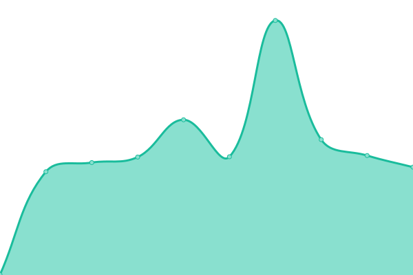

# [📈 Live Status](https://Adathor.github.io/upptime): <!--live status--> **🟧 Partial outage**

This repository contains the open-source uptime monitor and status page for [Andre Halvorsen](https://Adathor.github.io/upptime), powered by [Upptime](https://github.com/upptime/upptime).

With [Upptime](https://upptime.js.org), you can get your own unlimited and free uptime monitor and status page, powered entirely by a GitHub repository. We use [Issues](https://github.com/Adathor/upptime/issues) as incident reports, [Actions](https://github.com/Adathor/upptime/actions) as uptime monitors, and [Pages](https://Adathor.github.io/upptime) for the status page.

<!--start: status pages-->
<!-- This summary is generated by Upptime (https://github.com/upptime/upptime) -->
<!-- Do not edit this manually, your changes will be overwritten -->
<!-- prettier-ignore -->
| URL | Status | History | Response Time | Uptime |
| --- | ------ | ------- | ------------- | ------ |
|  [OSC](https://openstorage.xyz) | 🟩 Up | [osc.yml](https://github.com/apinter/OSC-mon/commits/HEAD/history/osc.yml) | 

 719ms
     
 | 

<a href="https://apinter.github.io/OSC-mon/history/osc">100.00%</a>
    

|  [Hedgedoc](https://hedgedoc.openstorage.xyz) | 🟥 Down | [hedgedoc.yml](https://github.com/apinter/OSC-mon/commits/HEAD/history/hedgedoc.yml) | 

 1184ms
     
 | 

<a href="https://apinter.github.io/OSC-mon/history/hedgedoc">100.00%</a>
    

|  [Parallel](parallel.openstorage.io) | 🟩 Up | [parallel.yml](https://github.com/apinter/OSC-mon/commits/HEAD/history/parallel.yml) | 

 17ms
     
 | 

<a href="https://apinter.github.io/OSC-mon/history/parallel">100.00%</a>
    

|  [Gitea](https://gitea.openstorage.xyz) | 🟥 Down | [gitea.yml](https://github.com/apinter/OSC-mon/commits/HEAD/history/gitea.yml) | 

 627ms
     
 | 

<a href="https://apinter.github.io/OSC-mon/history/gitea">88.10%</a>
    

|  [Harbor](https://registry.openstorage.xyz) | 🟩 Up | [harbor.yml](https://github.com/apinter/OSC-mon/commits/HEAD/history/harbor.yml) | 

 1721ms
     
 | 

<a href="https://apinter.github.io/OSC-mon/history/harbor">43.72%</a>
    

<!--end: status pages-->

[**Visit our status website →**](https://Adathor.github.io/upptime)

## 📄 License

- Powered by: [Upptime](https://github.com/upptime/upptime)
- Code: [MIT](./LICENSE) © [Andre Halvorsen](https://Adathor.github.io/upptime)
- Data in the `./history` directory: [Open Database License](https://opendatacommons.org/licenses/odbl/1-0/)
